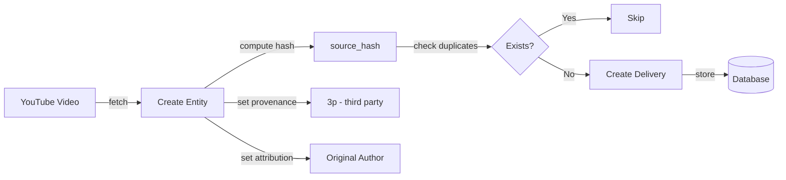
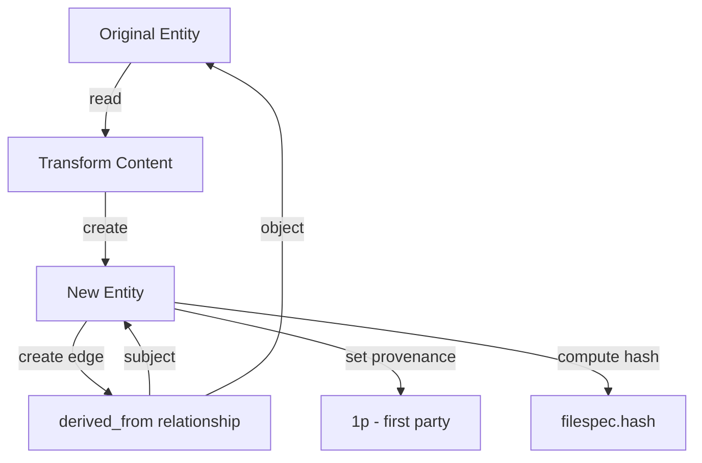
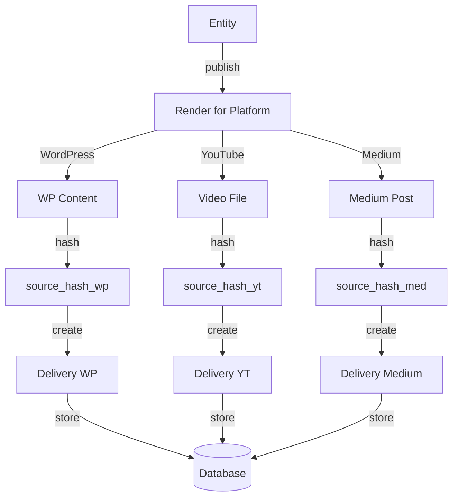

# Lineage and Provenance Tracking

> **Version:** 1.0.0 | **Last Updated:** 2025-01-20

This document explains Project Ike's approach to tracking the lineage and provenance of knowledge assets across the semantic operations platform.

---

## Table of Contents

- [Overview](#overview)
- [Configuration](#configuration)
- [Design Rationale](#design-rationale)
- [System Architecture](#system-architecture)
- [Implementation Components](#implementation-components)
- [Best Practices & Industry Standards](#best-practices--industry-standards)
- [Use Cases](#use-cases)
- [Example Workflows](#example-workflows)

---

## Overview

**Lineage tracking** in Project Ike is a multi-layered system that captures:

1. **Content Transformation** - How knowledge assets evolve and derive from each other
2. **Cross-Platform Publishing** - Where content is published and ingested across surfaces
3. **Version History** - Content state at specific points in time
4. **Provenance** - Original source and authorship attribution

Unlike Git (which tracks code changes), our lineage system tracks **semantic transformations of knowledge assets** across **all platforms** (YouTube, WordPress, Google Drive, GitHub, etc.).

---

## Configuration

### Enable/Disable Lineage Tracking

Lineage tracking can be toggled on or off via environment variables in your `.env` file. This is particularly useful during active development when you want to avoid logging noise from small, frequent changes.

#### Environment Variables

Add these to your `.env` file:

```bash
# Enable/disable lineage event logging to /lineage/events.ndjson
# Set to 'false' during active development to reduce noise
# Set to 'true' in production or when you want full audit trails
ENABLE_LINEAGE_TRACKING=false

# Lineage tracking modes:
# full - Log all events (entity changes, deliveries, edges, etc.)
# minimal - Log only major events (publishes, ingestions, major derivations)
# off - Disable all lineage logging
LINEAGE_TRACKING_MODE=minimal
```

#### Management Script

Use the `manage_lineage.py` script to easily toggle settings:

```bash
# Check current status
python scripts/manage_lineage.py status

# Enable tracking (recommended for production)
python scripts/manage_lineage.py enable

# Disable tracking (recommended during active development)
python scripts/manage_lineage.py disable

# Set tracking mode
python scripts/manage_lineage.py mode full # Log everything
python scripts/manage_lineage.py mode minimal # Log only major events
python scripts/manage_lineage.py mode off # Disable logging
```

#### Tracking Modes Explained

| Mode | When to Use | What Gets Logged |
|------|-------------|------------------|
| **full** | Production environments, compliance requirements | All events: entity changes, edge creation, delivery updates, GitHub events |
| **minimal** | Development with selective tracking | Only major events: publishes, ingestions, merges, releases |
| **off** | Active development, rapid iteration | Nothing (same as `ENABLE_LINEAGE_TRACKING=false`) |

#### Recommended Settings

**During Active Development:**
```bash
ENABLE_LINEAGE_TRACKING=false
# or
ENABLE_LINEAGE_TRACKING=true
LINEAGE_TRACKING_MODE=minimal
```

**In Production:**
```bash
ENABLE_LINEAGE_TRACKING=true
LINEAGE_TRACKING_MODE=full
```

**For Compliance/Audit Requirements:**
```bash
ENABLE_LINEAGE_TRACKING=true
LINEAGE_TRACKING_MODE=full
```

### Using Lineage Tracking in Code

Import and use the lineage utilities in your scripts:

```python
from scripts.lineage_utils import log_event

# Log an entity creation
log_event(
 "entity_created",
 {
 "entity_id": "blog-post-ai-intro",
 "content_kind": "blog_post"
 },
 user="tim"
)

# Log a delivery publish
log_event(
 "delivery_published",
 {
 "delivery_id": "del-123",
 "entity_id": "blog-post-ai-intro",
 "surface_id": "youtube-my-channel",
 "url": "https://youtube.com/watch?v=abc123"
 }
)

# The log_event function automatically checks if tracking is enabled
# and respects the configured mode (full/minimal/off)
```

**Check Tracking Status in Code:**
```python
from scripts.lineage_utils import get_tracking_status

status = get_tracking_status
print(f"Tracking enabled: {status['enabled']}")
print(f"Tracking mode: {status['mode']}")
```

---

## Design Rationale

### Why We Built This System

#### 1. **Multi-Platform Knowledge Operations**
Traditional version control systems (Git, SVN) are designed for code repositories. Project Ike operates across:
- Video platforms (YouTube)
- Content management systems (WordPress, Medium)
- Cloud storage (Google Drive, S3)
- Code repositories (GitHub)
- Social media (LinkedIn, Twitter)

**No single existing system tracks lineage across all these surfaces.**

#### 2. **Semantic Relationships**
We needed to capture relationships beyond simple "modified from":
- **derived_from**: Blog post created from video transcript
- **cites**: Research paper references multiple sources
- **uses**: Dashboard uses dataset as input
- **documents**: API docs document code implementation
- **depends_on**: Tutorial requires prerequisite knowledge

#### 3. **Data Integrity for AI Systems**
Modern AI/LLM systems require:
- **Trustworthy data** - Know the source and transformations
- **Deduplication** - Prevent processing same content multiple times
- **Version tracking** - Which version was used for training/RAG?
- **Audit trails** - Compliance and data governance

---

## System Architecture

### The Four Pillars

```
┌─────────────────────────────────────────────────────────────┐
│ LINEAGE TRACKING SYSTEM │
├─────────────────────────────────────────────────────────────┤
│ │
│ 1. EDGE TABLE 2. SOURCE HASH 3. METADATA │
│ (relationships) (content hash) (provenance)│
│ │
│ ┌───────┐ ┌──────┐ ┌─────────┐ │
│ │Entity │─────────────│Entity│─────────│Entity │ │
│ │ A │ derived_from│ B │ cites │ C │ │
│ └───────┘ └──────┘ └─────────┘ │
│ │ │ │ │
│ │ │ │ │
│ ┌───▼──────────────────────▼─────────────────▼───┐ │
│ │ DELIVERY (source_hash) │ │
│ │ Tracks exact version published to surface │ │
│ └──────────────────────────────────────────────┬─┘ │
│ │ │
│ 4. EVENT LOG (GitHub events + custom events) │ │
│ └───────────────────────────────────────────────────┘ │
└─────────────────────────────────────────────────────────────┘
```

---

## Implementation Components

### 1. Edge Table - Primary Lineage Mechanism

The `edge` table tracks **typed relationships** between entities:

```sql
CREATE TABLE edge (
 id text primary key,
 subject_id text not null references entity(id),
 predicate text not null, -- Semantic relationship type
 object_id text not null references entity(id),
 metadata jsonb,
 created_at timestamptz default now
);
```

**Lineage Predicates:**

| Predicate | Meaning | Example |
|-----------|---------|---------|
| `derived_from` | Entity created by transforming another | Blog post ← YouTube transcript |
| `documents` | Entity documents another entity | API docs ← Source code |
| `cites` | Entity references another entity | Research paper ← Studies |
| `uses` | Entity uses another as input | Dashboard ← Dataset |
| `implements` | Entity implements specification | Code ← Design document |
| `curates` | Entity is curated collection of others | Playlist ← Videos |
| `depends_on` | Entity requires another | Advanced tutorial ← Beginner tutorial |

**Example Query:**
```sql
-- Find all content derived from a specific video
SELECT e.*
FROM entity e
JOIN edge ON edge.object_id = 'video-ai-fundamentals'
WHERE edge.predicate = 'derived_from'
 AND edge.subject_id = e.id;
```

### 2. Delivery.source_hash - Content Fingerprinting

The `source_hash` field in the `delivery` table serves two critical functions:

#### Purpose:
1. **Deduplication** - Prevent duplicate deliveries of identical content
2. **Version Tracking** - Cryptographic fingerprint of content at delivery time

#### How It's Derived:

```python
import hashlib
from datetime import datetime

def compute_source_hash(entity_id: str, surface_id: str, content: bytes,
 timestamp: datetime = None) -> str:
 """
 Compute source hash for a delivery.

 Args:
 entity_id: ID of the entity being delivered
 surface_id: ID of the surface (platform)
 content: The actual content bytes at time of delivery
 timestamp: Optional timestamp (defaults to now)

 Returns:
 SHA-256 hash string
 """
 timestamp = timestamp or datetime.now

 # Hash components
 components = [
 entity_id.encode('utf-8'),
 surface_id.encode('utf-8'),
 content,
 timestamp.isoformat.encode('utf-8')
 ]

 # Concatenate and hash
 combined = b''.join(components)
 return hashlib.sha256(combined).hexdigest
```

#### Publishing Example:
```python
# Publishing entity to YouTube
entity = get_entity("blog-post-ai-intro")
surface = get_surface("youtube-my-channel")
video_file = render_video(entity) # Convert blog to video

source_hash = compute_source_hash(
 entity_id=entity.id,
 surface_id=surface.id,
 content=video_file.read, # Hash the actual video bytes
 timestamp=datetime.now
)

delivery = Delivery(
 entity_id=entity.id,
 surface_id=surface.id,
 source_hash=source_hash,
 status="queued"
)
```

#### Ingestion Example:
```python
# Ingesting content from external source
remote_content = youtube_api.get_video("abc123")
content_hash = hashlib.sha256(remote_content).hexdigest

source_hash = compute_source_hash(
 entity_id=f"video-{remote_id}",
 surface_id="youtube-external",
 content=remote_content,
 timestamp=remote_metadata.published_at
)

# Check for duplicates
existing = db.query(Delivery).filter(
 Delivery.source_hash == source_hash
).first

if existing:
 print("Already ingested this content, skipping")
else:
 # Create new entity and delivery
 ...
```

### 3. Entity Metadata - Provenance Attribution

Each entity carries provenance metadata:

```python
from pydantic import BaseModel
from typing import Literal

class Entity(BaseModel):
 id: str
 provenance: Literal["1p", "2p", "3p"] # Who created THIS artifact
 attribution: dict # Original authorship (JSONB: attribution_v1)
 filespec: dict # File hash, location (JSONB: filespec_v1)
 # ...
```

**Provenance Types:**
- **1p** (First-party): You created it directly
- **2p** (Second-party): Collaborator/team member created it
- **3p** (Third-party): External source (ingested content)

**Attribution Schema (attribution_v1.json):**
```json
{
 "$schema": "attribution_v1",
 "type": "attribution_v1",
 "primary_author": "Jane Doe",
 "authors": ["Jane Doe", "John Smith"],
 "source_url": "https://example.com/original",
 "license": "CC-BY-4.0",
 "created_date": "2024-01-15",
 "notes": "Adapted from workshop presentation"
}
```

### 4. Event Log - Append-Only Audit Trail

Located at `/lineage/events.ndjson`, this is an append-only log capturing:

- GitHub events (issues, PRs, releases)
- Custom events (entity creation, publishing, ingestion)
- System operations (schema migrations, data transformations)

**Format:** Newline-delimited JSON (NDJSON)

```jsonl
{"timestamp": "2024-01-20T10:30:00Z", "type": "entity_created", "entity_id": "blog-post-ai", "user": "tim"}
{"timestamp": "2024-01-20T11:00:00Z", "type": "delivery_published", "delivery_id": "del-123", "surface": "youtube", "status": "success"}
{"timestamp": "2024-01-20T12:00:00Z", "type": "github_pr_merged", "pr_number": 42, "repo": "ike-semops"}
```

---

## Best Practices & Industry Standards

Our lineage system is inspired by and aligns with:

### 1. **W3C PROV Data Model**
[W3C PROV](https://www.w3.org/TR/prov-overview/) defines provenance as:

> "Information about entities, activities, and people involved in producing a piece of data, which can be used to assess quality, reliability, or trustworthiness."

**PROV Concepts Applied:**
- **Entity**: Our `entity` table
- **Activity**: Publishing/ingestion operations (tracked in `delivery`)
- **Agent**: Attribution metadata (authors, systems)
- **Derivation**: `edge.predicate = 'derived_from'`

### 2. **Data Lineage in Analytics Platforms**

Systems like **Apache Atlas**, **Google Data Catalog**, and **AWS Glue** use similar patterns:

| System | Lineage Mechanism | Our Equivalent |
|--------|-------------------|----------------|
| Apache Atlas | Entity relationships with type metadata | `edge` table with predicates |
| Google Data Catalog | Lineage API tracking data transformations | `derived_from` edges |
| AWS Glue | Data Catalog with versioning | `filespec.hash` + `source_hash` |

### 3. **Content Addressable Storage**

Similar to **Git**, **IPFS**, and **Merkle trees**, we use:
- **Content hashing** (`filespec.hash`, `source_hash`)
- **Immutable references** (hash never changes for same content)
- **Deduplication** (same hash = same content)

### 4. **Semantic Web & Knowledge Graphs**

Our `edge` table with typed predicates follows **RDF/SPARQL** patterns:
- **Subject-Predicate-Object** triples
- **Typed relationships** (not just generic "links")
- **Graph traversal** for lineage queries

### 5. **Regulatory Compliance**

Supports requirements from:
- **GDPR**: Article 30 (Records of processing activities)
- **HIPAA**: Audit trail requirements
- **SOC 2**: Change management and data integrity
- **AI Act (EU)**: Transparency and explainability of data sources

---

## Use Cases

### 1. Content Lifecycle Tracking

**Scenario:** Track a knowledge asset from creation to publication

```
1. Create video transcript (entity A)
 └─ provenance: 3p (imported from YouTube)

2. Derive blog post from transcript (entity B)
 └─ edge: B derived_from A
 └─ provenance: 1p (you created it)

3. Publish blog to WordPress (delivery 1)
 └─ source_hash: hash(B + wordpress + content + timestamp)

4. Syndicate to Medium (delivery 2)
 └─ source_hash: hash(B + medium + content + timestamp)
```

**Query:** Find all content derived from external YouTube videos:
```sql
SELECT e.id, e.title
FROM entity e
JOIN edge ON e.id = edge.subject_id
JOIN entity source ON edge.object_id = source.id
WHERE edge.predicate = 'derived_from'
 AND source.provenance = '3p';
```

### 2. Deduplication

**Scenario:** Prevent re-publishing identical content

```python
def publish_to_surface(entity_id: str, surface_id: str):
 entity = get_entity(entity_id)
 surface = get_surface(surface_id)

 # Compute hash of current content
 content = render_for_platform(entity, surface)
 new_hash = compute_source_hash(entity_id, surface_id, content)

 # Check if already published
 existing = db.query(Delivery).filter(
 Delivery.entity_id == entity_id,
 Delivery.surface_id == surface_id,
 Delivery.source_hash == new_hash
 ).first

 if existing:
 return {"status": "skipped", "reason": "identical_content_already_published"}

 # Proceed with publishing
 ...
```

### 3. Content Drift Detection

**Scenario:** Detect when published content differs from source

```python
def check_content_drift(delivery_id: str):
 delivery = get_delivery(delivery_id)
 entity = get_entity(delivery.entity_id)

 # Recompute hash with current entity content
 current_content = render_for_platform(entity, delivery.surface)
 current_hash = compute_source_hash(
 delivery.entity_id,
 delivery.surface_id,
 current_content
 )

 if current_hash != delivery.source_hash:
 return {
 "drifted": True,
 "recommendation": "republish",
 "original_hash": delivery.source_hash,
 "current_hash": current_hash
 }

 return {"drifted": False}
```

### 4. Audit Trail for AI Training

**Scenario:** Track which data versions were used for RAG/fine-tuning

```sql
-- Find all entities used in a specific training run
SELECT
 e.id,
 e.title,
 e.filespec->>'hash' as content_hash,
 d.source_hash as version_hash,
 d.published_at
FROM training_runs tr
JOIN training_run_entities tre ON tr.id = tre.training_run_id
JOIN delivery d ON tre.delivery_id = d.id
JOIN entity e ON d.entity_id = e.id
WHERE tr.id = 'training-run-2024-01';
```

---

## Example Workflows

### Workflow 1: Ingesting External Content



### Workflow 2: Deriving New Content



### Workflow 3: Cross-Platform Publishing



---

## Query Examples

### Find Content Lineage Chain

```sql
-- Recursive CTE to find full lineage chain
WITH RECURSIVE lineage AS (
 -- Base case: start with target entity
 SELECT
 id,
 title,
 0 as depth,
 ARRAY[id] as path
 FROM entity
 WHERE id = 'blog-post-final'

 UNION

 -- Recursive case: find ancestors
 SELECT
 e.id,
 e.title,
 l.depth + 1,
 l.path || e.id
 FROM entity e
 JOIN edge ON e.id = edge.object_id
 JOIN lineage l ON edge.subject_id = l.id
 WHERE edge.predicate = 'derived_from'
 AND NOT e.id = ANY(l.path) -- Prevent cycles
)
SELECT * FROM lineage
ORDER BY depth;
```

### Detect Unpublished Updates

```sql
-- Find entities that changed since last publish
SELECT
 e.id,
 e.title,
 e.updated_at,
 d.published_at,
 e.filespec->>'hash' as current_hash,
 d.source_hash as published_hash
FROM entity e
JOIN delivery d ON e.id = d.entity_id
WHERE e.updated_at > d.published_at
 AND d.status = 'published'
 AND d.role = 'original';
```

---

## Future Enhancements

### Planned Features

1. **Lineage Visualization**
 - Graph UI showing entity relationships
 - Timeline view of transformations
 - Interactive provenance explorer

2. **Automated Drift Detection**
 - Scheduled jobs checking source_hash vs current content
 - Notifications when content needs republishing

3. **Lineage-based RAG**
 - Prefer entities with clear provenance for vector embeddings
 - Weight search results by lineage quality

4. **Compliance Reporting**
 - Generate GDPR Article 30 reports
 - Export audit trails for regulatory review

---

## References

### Standards & Specifications
- [W3C PROV Data Model](https://www.w3.org/TR/prov-overview/)
- [Dublin Core Metadata Initiative](https://www.dublincore.org/)
- [FAIR Data Principles](https://www.go-fair.org/fair-principles/)

### Similar Systems
- [Apache Atlas](https://atlas.apache.org/) - Data governance and metadata
- [Google Data Catalog](https://cloud.google.com/data-catalog) - Metadata management
- [AWS Glue Data Catalog](https://aws.amazon.com/glue/) - Data discovery

### Academic Research
- "PROV-DM: The PROV Data Model" - W3C Recommendation
- "Provenance in Databases: Why, How, and Where" - ACM Computing Surveys
- "A Survey of Data Provenance in e-Science" - ACM SIGMOD Record

---

**Last Updated:** 2025-01-20 | **Maintainer:** Project Ike Team
