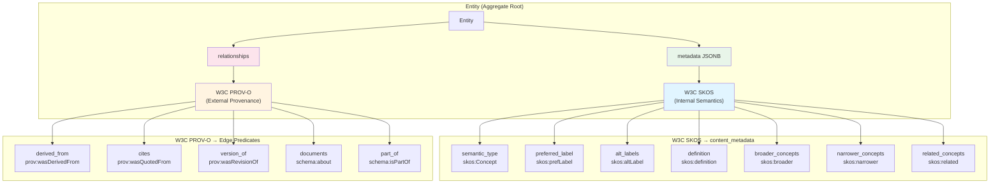
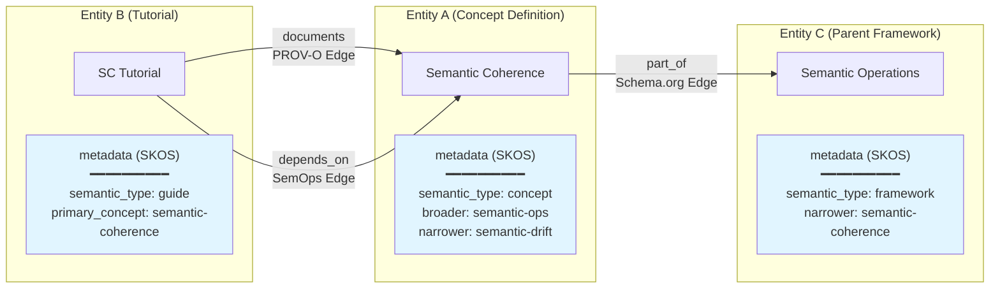

# W3C Standards Mapping: SKOS + PROV-O

> **Visual guide to SemOps's W3C standards-based architecture**
>
> Last Updated: 2025-11-21

## Overview

SemOps implements a dual-standard architecture based on W3C semantic web specifications:

- **W3C SKOS (Simple Knowledge Organization System)** → `content_metadata` (semantics WITHIN entities)
- **W3C PROV-O (Provenance Ontology)** → Edge predicates (relationships BETWEEN entities)

This separation provides a clean, standards-compliant architecture for semantic content management.

---

## Architecture Diagram



---

## SKOS Mapping: Content Metadata

### Purpose
**Describe concepts and their hierarchies WITHIN a single entity**

### W3C Standard
[W3C SKOS Reference](https://www.w3.org/TR/skos-reference/)

### Implementation
Stored in Entity's `metadata` JSONB field as `content_metadata_v1`

### Complete Mapping Table

| SemOps Field | SKOS Property | Description | Example |
|-------------------|---------------|-------------|---------|
| `semantic_type` | `rdf:type skos:Concept` | What kind of concept this is | `"concept"`, `"framework"` |
| `preferred_label` | `skos:prefLabel` | Preferred human-readable label | `"Semantic Coherence"` |
| `alt_labels[]` | `skos:altLabel` | Alternative labels/synonyms | `["SemCo", "Coherence"]` |
| `definition` | `skos:definition` | Formal concept definition | `"The degree of shared meaning..."` |
| `broader_concepts[]` | `skos:broader` | More general/parent concepts | `["semantic-operations"]` |
| `narrower_concepts[]` | `skos:narrower` | More specific/child concepts | `["semantic-drift"]` |
| `related_concepts[]` | `skos:related` | Associatively related concepts | `["knowledge-graphs"]` |
| `scope_note` | `skos:scopeNote` | Usage context and scope | `"Use when analyzing..."` |
| `example` | `skos:example` | Example usage | `"A team using..."` |
| `history_note` | `skos:historyNote` | Historical context | `"First introduced in 2024..."` |

### Example JSON

```json
{
  "$schema": "content_metadata_v1",
  "semantic_type": "concept",
  "preferred_label": "Semantic Coherence",
  "alt_labels": ["SemCo", "Coherence"],
  "definition": "The degree of shared meaning and mutual understanding within a semantic context",
  "broader_concepts": ["semantic-operations", "knowledge-management"],
  "narrower_concepts": ["semantic-drift", "coherence-audit"],
  "related_concepts": ["knowledge-graphs", "domain-driven-design"],
  "scope_note": "Use this concept when analyzing shared understanding in distributed teams",
  "primary_concept": "semantic-coherence",
  "domain": "knowledge-management",
  "abstraction_level": "intermediate"
}
```

---

## PROV-O Mapping: Edge Predicates

### Purpose
**Track provenance relationships BETWEEN entities**

### W3C Standard
[W3C PROV-O Specification](https://www.w3.org/TR/prov-o/)

### Implementation
Stored as typed edges in the `edge` table with directional relationships

### Complete Mapping Table

| SemOps Predicate | W3C Property | Description | Direction | Example |
|-----------------------|--------------|-------------|-----------|---------|
| `derived_from` | `prov:wasDerivedFrom` | Entity created by transforming source | Derivative → Original | Transcript → Video |
| `cites` | `prov:wasQuotedFrom` | Entity references/quotes source | Citing → Cited | Blog Post → Paper |
| `version_of` | `prov:wasRevisionOf` | Entity is revision of earlier version | New → Old | v2.0 → v1.0 |
| `part_of` | `schema:isPartOf` | Entity is component of larger whole | Part → Whole | Chapter → Book |
| `documents` | `schema:about` (inverted) | Entity explains/documents concept | Docs → Concept | Guide → Framework |
| `depends_on` | *(SemOps extension)* | Entity requires prerequisite knowledge | Advanced → Basic | Tutorial 2 → Tutorial 1 |
| `related_to` | `skos:related` | Entities are conceptually related | A ↔ B | Framework A ↔ Framework B |

### Example Relationships

```yaml
relationships:
  # PROV-O: Derivation lineage
  - predicate: derived_from
    target_id: source-video-karpathy
    strength: 1.0

  # PROV-O: Citation/attribution
  - predicate: cites
    target_id: research-paper-attention
    strength: 0.9

  # PROV-O: Version succession
  - predicate: version_of
    target_id: dikw-framework-v1
    strength: 1.0

  # Schema.org: Compositional hierarchy
  - predicate: part_of
    target_id: semantic-operations-framework
    strength: 1.0

  # Schema.org: Documentation relationship
  - predicate: documents
    target_id: semantic-coherence-concept
    strength: 1.0

  # SemOps: Learning path dependency
  - predicate: depends_on
    target_id: dikw-basics
    strength: 0.8
```

---

## Conceptual Diagram: SKOS vs PROV-O



---

## When to Use SKOS vs PROV-O

### Use SKOS (content_metadata) when:
- ✅ Describing what a concept IS
- ✅ Defining hierarchical concept relationships (broader/narrower)
- ✅ Providing labels, definitions, examples
- ✅ Information is intrinsic to the entity itself
- ✅ No other entity is needed to understand this

**Example:** "Semantic Coherence is a broader concept than Semantic Drift"

### Use PROV-O (edge predicates) when:
- ✅ Tracking where content came from (derivation)
- ✅ Recording citations and attributions
- ✅ Expressing version history
- ✅ Defining cross-entity dependencies
- ✅ Information requires TWO entities to make sense

**Example:** "This transcript was derived from that video"

---

## Real-World Example

### Scenario: Blog post about Semantic Coherence

```yaml
---
# Entity: blog-post-coherence-2024
entity_id: blog-post-coherence-2024
title: Understanding Semantic Coherence

# SKOS: Internal semantics
metadata:
  $schema: content_metadata_v1
  semantic_type: guide                          # What it IS
  preferred_label: "Understanding Semantic Coherence Guide"
  primary_concept: semantic-coherence           # What it's ABOUT
  broader_concepts: ["semantic-operations"]     # Concept hierarchy
  related_concepts: ["knowledge-graphs"]
  domain: knowledge-management
  abstraction_level: intermediate
  semantic_roles: ["tutorial", "example"]

# PROV-O: External provenance
relationships:
  # Documents the concept (this guide explains that concept)
  - predicate: documents
    target_id: semantic-coherence-concept
    strength: 1.0

  # Derived from notes (provenance lineage)
  - predicate: derived_from
    target_id: notes-coherence-2024
    strength: 0.9

  # Cites research paper (attribution)
  - predicate: cites
    target_id: paper-shared-understanding
    strength: 0.8

  # Depends on prerequisite (learning path)
  - predicate: depends_on
    target_id: semantic-operations-intro
    strength: 0.7
---
```

**Result:**
- **SKOS** captures: "This is an intermediate-level tutorial guide about Semantic Coherence"
- **PROV-O** captures: "It documents the SC concept, was derived from notes, cites a paper, and depends on the intro"

---

## Benefits of This Architecture

### 1. **Standards Compliance**
- Built on established W3C specifications
- Interoperable with other semantic web systems
- Future-proof against architectural changes

### 2. **Clean Separation of Concerns**
- Internal semantics (SKOS) vs external provenance (PROV-O)
- Metadata vs relationships
- Intrinsic vs extrinsic properties

### 3. **Queryability**
```sql
-- SKOS queries (within entity)
SELECT * FROM entity
WHERE metadata->>'semantic_type' = 'concept';

SELECT * FROM entity
WHERE metadata->'broader_concepts' ? 'semantic-operations';

-- PROV-O queries (between entities)
SELECT * FROM edge
WHERE predicate = 'derived_from';

SELECT dst_id FROM edge
WHERE src_id = 'my-article' AND predicate = 'cites';
```

### 4. **Extensibility**
- SKOS: Add new semantic fields without breaking schema
- PROV-O: Add new predicates for domain-specific relationships
- Both stored in JSONB for flexible evolution

---

## See Also

### Project Documentation
- [content_metadata_v1.json](metadata/content_metadata_v1.json) - SKOS schema
- [UBIQUITOUS_LANGUAGE.md](UBIQUITOUS_LANGUAGE.md) - Domain terminology
- [SCHEMA_REFERENCE.md](SCHEMA_REFERENCE.md) - Data dictionary

### W3C Standards
- [W3C SKOS Reference](https://www.w3.org/TR/skos-reference/) - Simple Knowledge Organization System
- [W3C SKOS Primer](https://www.w3.org/TR/skos-primer/) - SKOS introduction and tutorial
- [W3C PROV-O](https://www.w3.org/TR/prov-o/) - Provenance Ontology specification
- [W3C PROV Primer](https://www.w3.org/TR/prov-primer/) - PROV introduction and examples
- [Schema.org](https://schema.org/) - Structured data vocabulary
- [Dublin Core](https://www.dublincore.org/specifications/dublin-core/) - Metadata terms

---

*This architecture provides a standards-compliant foundation for semantic content operations, combining the best of knowledge organization (SKOS) and provenance tracking (PROV-O).*
