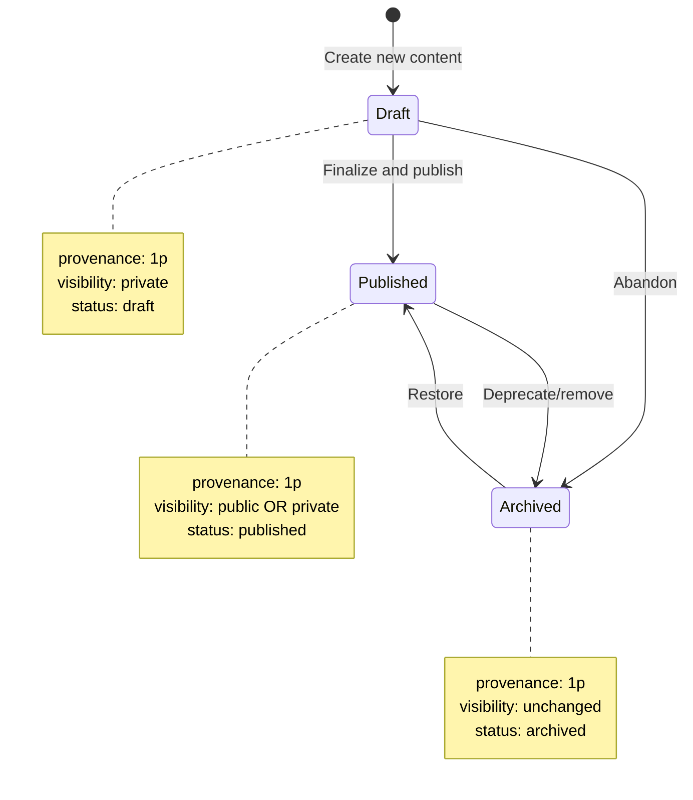
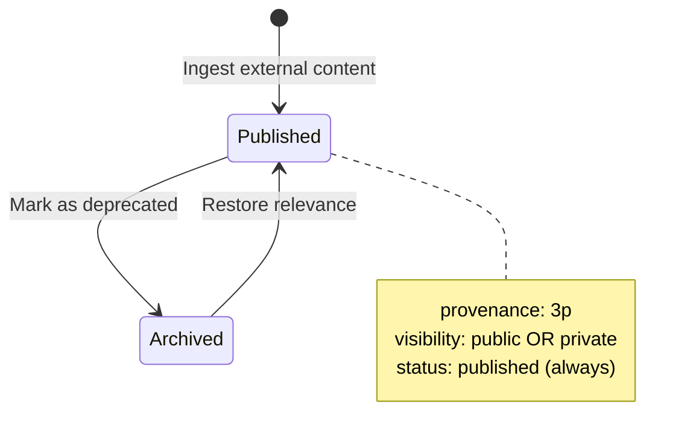
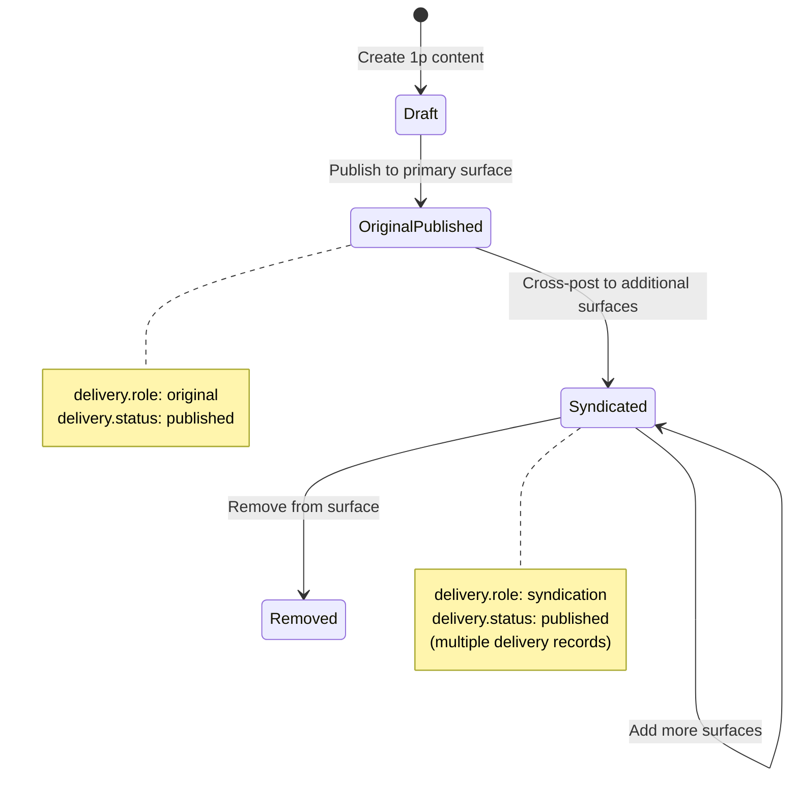

# Domain Patterns

> Meaningful combinations of attributes that define specific business workflows and contexts in the Project Ike publishing domain.
> **Version:** 1.0.0 | **Last Updated:** 2025-11-21

This document describes the common patterns that emerge when combining entity attributes in the Project Ike schema. These patterns represent real-world publishing workflows and content operations.

## Domain Context

Project Ike operates in the **digital publishing** domain with extensions into:
- **Content Management Systems (CMS)** - Content lifecycle and versioning
- **Digital Asset Management (DAM)** - Asset storage and retrieval
- **Knowledge Management** - Semantic relationships and graph-based knowledge
- **AI/LLM Operations** - RAG systems, content generation, and agent workflows

See [UBIQUITOUS_LANGUAGE.md](./UBIQUITOUS_LANGUAGE.md) for foundational term definitions.

---

## Multi-Domain Convergence

Project Ike's schema represents a **convergence of established patterns** from multiple specialized domains, creating a unified system for knowledge-first digital publishing.

### Primary Domain: Digital Publishing

The overarching domain is **digital publishing** - the entire lifecycle of creating, managing, and distributing content across multiple channels.

### Adopted Industry Patterns

```
Project Ike Schema (Convergence Model)
┌──────────────────────────────────────────────────────┐
│ Digital Publishing (Umbrella Domain) │
├──────────────────────────────────────────────────────┤
│ │
│ ✅ DAM (Digital Asset Management) │
│ • Approval workflows (pending/approved/rejected) │
│ • Asset storage and organization │
│ • Multi-channel distribution tracking │
│ • Version control and metadata │
│ │
│ ✅ CMS (Content Management System) │
│ • Content lifecycle (draft → published) │
│ • Visibility controls (public/private) │
│ • Multi-surface publishing │
│ • Syndication support │
│ │
│ ✅ Knowledge Management / Graph Database │
│ • Semantic relationships (Edge entity) │
│ • Typed predicates (cites, derived_from, etc.) │
│ • Relationship strength weighting │
│ • Graph-based lineage tracking │
│ │
│ ✅ PIM (Product Information Management) │
│ • Channel syndication patterns │
│ • Platform-specific field mapping │
│ • Centralized source of truth │
│ │
│ ✅ AI/LLM Operations (Emerging) │
│ • RAG-aware architecture │
│ • Agent attribution tracking │
│ • Quality scoring for retrieval │
│ • Internal surfaces for vector DBs │
│ │
└──────────────────────────────────────────────────────┘
```

### Unique Innovations

Beyond adopting industry standards, Project Ike introduces novel patterns:

**1. Provenance-First Design (1P/2P/3P)**
- Differentiates owned content from referenced content
- Tracks collaborative vs external sources
- Enables derivative work attribution
- **No equivalent in traditional DAM/CMS**

**2. Unified Catalog (Owned + Referenced)**
- Single system for both your content AND external references
- External links cataloged alongside owned assets
- Citations and sources as first-class entities
- **Traditional DAM only manages owned assets**

**3. Derivative Work Lineage**
- Explicit `derived_from` edges for transformations
- Transcripts, quotes, summaries tracked as 1P derivatives from 3P sources
- Multi-hop derivation chains
- **Traditional CMS doesn't track content lineage**

**4. Dual-Status Model**
- **Approval Status** (Entity) - Is it ready?
- **Delivery Status** (Delivery) - Where is it live?
- Separation enables "approved but not yet delivered" state
- **Matches DAM best practices but rare in CMS**

**5. Graph-Native Relationships**
- Rich semantic predicates beyond simple parent/child
- Relationship strength for ranking and filtering
- Bidirectional querying (what cites this? what does this cite?)
- **Traditional DAM/CMS use hierarchical folders, not graphs**

### What This Is NOT

To clarify boundaries:

**Not Pure DAM:**
- DAM lacks knowledge graph relationships
- DAM doesn't track content provenance (1P/2P/3P)
- DAM doesn't model derivative work lineage
- DAM doesn't integrate RAG/AI operations

**Not Pure CMS:**
- CMS doesn't have approval workflows like DAM
- CMS doesn't track external references as entities
- CMS uses hierarchical taxonomies, not semantic graphs
- CMS doesn't distinguish file vs link at schema level

**Not Pure Knowledge Graph:**
- Knowledge graphs don't have publishing workflows
- Knowledge graphs don't track approval states
- Knowledge graphs don't integrate with distribution channels
- Knowledge graphs don't have DAM-style versioning

### The Result: Semantic Content Operations

**What to call this?**

> **"Semantic Content Operations"** or **"Knowledge-First Digital Publishing"**

A system that combines:
- The rigor of DAM (approval workflows, asset management)
- The flexibility of CMS (multi-channel publishing)
- The intelligence of knowledge graphs (semantic relationships)
- The future-readiness of AI operations (RAG, agent integration)

All unified under a provenance-first, graph-native architecture.

---

## W3C Standards Foundation

Project Ike is built on W3C semantic web standards to ensure interoperability and long-term viability:

### **SKOS (Simple Knowledge Organization System)** → `content_metadata`

**Purpose:** Semantic content organization WITHIN entities

[W3C SKOS Reference](https://www.w3.org/TR/skos-reference/)

**SKOS Properties Mapped to content_metadata:**
- `skos:Concept` → `metadata.semantic_type: "concept"`
- `skos:prefLabel` → `metadata.preferred_label`
- `skos:altLabel` → `metadata.alt_labels`
- `skos:definition` → `metadata.definition`
- `skos:broader` → `metadata.broader_concepts`
- `skos:narrower` → `metadata.narrower_concepts`
- `skos:related` → `metadata.related_concepts`
- `skos:scopeNote` → `metadata.scope_note`
- `skos:example` → `metadata.example`

**Example:**
```yaml
metadata:
 $schema: content_metadata_v1
 semantic_type: concept # rdf:type skos:Concept
 preferred_label: "Semantic Coherence" # skos:prefLabel
 broader_concepts: ["semantic-operations"] # skos:broader
 narrower_concepts: ["semantic-drift"] # skos:narrower
 definition: "The degree of shared..." # skos:definition
```

### **PROV-O (Provenance Ontology)** → Edge Predicates

**Purpose:** Provenance relationships BETWEEN entities

[W3C PROV-O Specification](https://www.w3.org/TR/prov-o/)

**PROV-O Properties Mapped to Edge Predicates:**
- `prov:wasDerivedFrom` → `derived_from`
- `prov:wasQuotedFrom` → `cites`
- `prov:wasRevisionOf` → `version_of`

**Example:**
```yaml
relationships:
 - predicate: derived_from # prov:wasDerivedFrom
 target_id: source-video
 strength: 1.0
```

See [SKOS_PROVO_MAPPING.md](../docs/SKOS_PROVO_MAPPING.md) for visual architecture diagram.

---

## Industry Pattern Alignment

Beyond W3C standards, Project Ike adopts established patterns from Digital Asset Management (DAM) and Content Management System (CMS) industries to ensure compatibility with standard workflows and terminology.

### DAM Pattern: Approval Workflow

**Industry Standard:** Asset approval workflows with states like pending, approved, and rejected are core to DAM systems.

**Sources:**
- [Bynder Asset Workflow](https://support.bynder.com/hc/en-us/articles/360013932879-Asset-Workflow-Assets) - Uses "In Review", "Approved", "Rejected" statuses
- [Adobe Experience Manager](https://experienceleague.adobe.com/en/docs/experience-manager-cloud-service/content/assets/dynamicmedia/dynamic-media-open-apis/approve-assets) - Uses "Expired", "Published", "Approved", "Rejected" statuses
- [Acquia DAM (Webdam)](https://www.damsuccess.com/hc/en-us/articles/360000037590-Webdam-Reports) - Tracks "Published", "Scheduled to Publish", "Failed", "Canceled" statuses
- [Brandfolder](https://help.brandfolder.com/hc/en-us/articles/360002467213-Asset-Availability-) - Uses "Pending Admin Review" with availability controls

**Our Implementation:**
- **Entity Attribute:** `approval_status` with values `pending | approved | rejected`
- **Semantic Meaning:** Represents asset readiness and approval state in the catalog
- **Applies To:** All content (1P, 2P, 3P) - differentiates from "published to external surfaces"

**Key Insight:** Approval status (is it ready?) is independent of delivery status (where is it live?). This separation matches DAM best practices.

### DAM Pattern: Multi-Channel Distribution

**Industry Standard:** DAM systems enable content distribution across multiple channels with tracking and analytics.

**Sources:**
- [Pimcore DAM](https://pimcore.com/en/products/digital-asset-management) - "Smart multi-channel publishing across digital, social, mobile, print"
- [Hivo DAM - Content Syndication](https://hivo.co/blog/leveraging-dam-for-content-syndication) - "Strategic sharing of digital assets to various platforms"
- [Hivo DAM - Web Syndication](https://hivo.co/blog/how-dam-facilitates-web-content-syndication) - Version tracking and analytics across channels

**Our Implementation:**
- **Surface Entity:** Platform/channel configuration (YouTube, WordPress, Medium, etc.)
- **Delivery Entity:** Distribution records tracking where and when content was published
- **Role Attribute:** `original | syndication` differentiates primary vs cross-posted content
- **Status Tracking:** Each delivery has independent `planned | queued | published | failed | removed` status

**Key Features:**
- ✅ One asset, multiple deliveries (syndication support)
- ✅ Platform-specific field mapping
- ✅ Version tracking via `source_hash`
- ✅ Analytics metadata per delivery

### DAM Pattern: Asset Lifecycle Management

**Industry Standard:** DAM workflows track assets through creation, approval, distribution, and archival stages.

**Sources:**
- [Frontify DAM Workflows](https://www.frontify.com/en/guide/dam-workflows) - Lifecycle: Creation → Ingestion → Approval → Active → Archived
- [CommPort - What is DAM](https://www.commport.com/what-is-digital-asset-management/) - "Track all versions ensuring only approved content is used"

**Our Implementation:**

```
1P/2P Content Lifecycle:
pending (draft/development) → approved (ready for use) → rejected (not approved)

3P Content Lifecycle:
pending (staged in inbox, needs cataloging) → approved (fully cataloged) → rejected (not relevant)
```

**Delivery Lifecycle (Independent):**
```
planned → queued → published (or failed/removed)
```

**Note:** The dual-status model (approval + delivery) allows content to be "approved and ready" without being "delivered to surfaces yet."

---

## Publication Context Patterns

These patterns combine `provenance`, `visibility`, `status`, and publication surfaces to define how content moves through the system.

### Pattern: Internal Knowledge Curation (3p + Private)

**Definition:** External content collected and made available for internal use in knowledge systems.

**Aggregate Root Attributes:**
- `provenance`: `3p` (created by external party)
- `visibility`: `private` (restricted to internal use)
- `approval_status`: `approved` (finalized and indexed)
- `asset_type`: Typically `link` (external reference) or `file` (downloaded copy)

**Surface Types:**
- Vector databases (RAG systems)
- Internal knowledge repositories
- Personal note systems
- Graph databases

**Use Cases:**
- Research paper added to vector database for RAG retrieval
- YouTube video transcript indexed for internal search
- Third-party blog post quote saved for future (public) citation
- Academic paper saved for future reference and possible citation
 
**Example Entity:**
```json
{
 "id": "research-attention-is-all-you-need",
 "asset_type": "link",
 "title": "Attention Is All You Need",
 "provenance": "3p",
 "approval_status": "approved",
 "visibility": "private",
 "filespec": {
 "$schema": "filespec_v1",
 "uri": "https://arxiv.org/abs/1706.03762",
 "platform": "arxiv"
 },
 "metadata": {
 "$schema": "content_metadata_v1",
 "content_type": "research_paper",
 "subject_area": ["AI/ML", "NLP"]
 }
}
```

**Related Edges:**
- May have `curates` edge from your collection entity
- May have `cites` edge from your own content that references it

---

### Pattern: Public Citation (Public 3P Reference)

**Definition:** External content you're referencing or attributing in your public-facing work.

**Attributes:**
- `provenance`: `3p` (created by external party)
- `visibility`: `public` (referenced in public context)
- `approval_status`: `approved` (already published by original author)
- `asset_type`: `link` (reference to external source)

**Surface Types:**
- Your blog posts (via `cites` edge)
- Public documentation
- Educational content
- Published articles

**Use Cases:**
- Research paper cited in blog post
- YouTube video embedded in educational content
- Open source project referenced in technical guide
- External article linked as supporting evidence

**Example with Edge:**
```json
// 3P Entity (the cited content)
{
 "id": "openai-gpt4-technical-report",
 "asset_type": "link",
 "provenance": "3p",
 "approval_status": "approved",
 "visibility": "public",
 "filespec": {
 "uri": "https://arxiv.org/abs/2303.08774",
 "platform": "arxiv"
 }
}

// Edge from your blog post
{
 "source_id": "blog-understanding-gpt4",
 "destination_id": "openai-gpt4-technical-report",
 "predicate": "cites",
 "strength": 0.9
}
```

**Key Distinction from Internal Curation:**
- `visibility=public` signals this is part of public-facing attribution
- Often connected via `cites` edge rather than stored for internal retrieval
- May have different licensing/copyright implications

---

### Pattern: Original Publication (Public 1P)

**Definition:** Your original content published publicly for the first time.

**Attributes:**
- `provenance`: `1p` (you created it)
- `visibility`: `public` (intended for public access)
- `approval_status`: `approved` (finalized and released)
- `asset_type`: `file` (you possess the content)

**Delivery Attributes:**
- `role`: `original` (first publication)
- `approval_status`: `approved`
- One delivery per entity with `role=original`

**Surface Types:**
- Your WordPress blog
- Your YouTube channel
- Your GitHub repositories
- Your Medium publication

**Use Cases:**
- Blog post published on your site
- Video uploaded to your channel
- Code repository pushed to GitHub
- Research paper published on your platform

**Example with Delivery:**
```json
// Entity
{
 "id": "blog-post-semantic-operations-intro",
 "asset_type": "file",
 "provenance": "1p",
 "approval_status": "approved",
 "visibility": "public",
 "filespec": {
 "uri": "file:///content/blog/semantic-ops-intro.md",
 "format": "markdown"
 }
}

// Delivery (original publication)
{
 "id": "delivery-blog-wordpress-001",
 "entity_id": "blog-post-semantic-operations-intro",
 "surface_id": "wordpress-my-blog",
 "role": "original",
 "approval_status": "approved",
 "url": "https://myblog.com/semantic-operations-intro",
 "published_at": "2024-11-15T09:00:00Z"
}
```

---

### Pattern: Content Syndication (Public 1P Republication)

**Definition:** Your content republished to additional platforms after original publication.

**Attributes:**
- `provenance`: `1p` (you created it)
- `visibility`: `public` (public on all surfaces)
- `approval_status`: `approved` (already finalized)

**Delivery Attributes:**
- `role`: `syndication` (cross-posted)
- Multiple deliveries with `role=syndication`
- At least one delivery with `role=original` should exist (or is implied)

**Surface Types:**
- Medium (cross-posting blog)
- LinkedIn (article sharing)
- Dev.to (developer content)
- Hashnode (blog syndication)

**Use Cases:**
- Blog post cross-posted to Medium
- YouTube video shared to LinkedIn
- GitHub project featured on multiple platforms
- Newsletter content republished as blog post

**Example Multi-Surface Delivery:**
```json
// Original delivery
{
 "entity_id": "blog-post-semantic-operations-intro",
 "surface_id": "wordpress-my-blog",
 "role": "original",
 "url": "https://myblog.com/semantic-operations-intro"
}

// Syndication delivery 1
{
 "entity_id": "blog-post-semantic-operations-intro",
 "surface_id": "medium-my-publication",
 "role": "syndication",
 "url": "https://medium.com/@me/semantic-operations-intro"
}

// Syndication delivery 2
{
 "entity_id": "blog-post-semantic-operations-intro",
 "surface_id": "linkedin-my-profile",
 "role": "syndication",
 "url": "https://linkedin.com/articles/semantic-ops"
}
```

**Business Rules:**
- Canonical URL typically points to `role=original` delivery
- Syndication may include attribution/backlink to original
- Timing: syndication usually happens after original publication

---

### Pattern: Private Draft (1P Work in Progress)

**Definition:** Content you're actively developing that isn't ready for publication.

**Attributes:**
- `provenance`: `1p` (you're creating it)
- `visibility`: `private` (internal only)
- `approval_status`: `pending` (not finalized)
- `asset_type`: `file` (you're working on it locally)

**Surface Implications:**
- NO delivery records should exist (drafts aren't delivered)
- May exist in local filesystem or private workspace

**Use Cases:**
- Unfinished blog post
- Script for future video
- Research notes in progress
- Code before first commit

**Example:**
```json
{
 "id": "draft-blog-advanced-rag-techniques",
 "asset_type": "file",
 "provenance": "1p",
 "approval_status": "pending",
 "visibility": "private",
 "filespec": {
 "uri": "file:///drafts/advanced-rag.md",
 "format": "markdown"
 },
 "metadata": {
 "content_type": "blog_post",
 "word_count": 487
 }
}
```

**State Transitions:**
```
draft → published (when ready to publish)
draft → archived (if abandoned)
```

---

### Pattern: Derived Knowledge Asset (1P from 3P)

**Definition:** Transformations or extractions you created from external source material.

**Attributes:**
- `provenance`: `1p` (YOU created the derivative work)
- `visibility`: `private` OR `public` (depending on use)
- `approval_status`: `approved` (finalized extraction/transformation)
- `asset_type`: `file` (you possess the derivative)

**Required Edge:**
- Edge with `predicate=derived_from` pointing to the 3p source entity

**Use Cases:**
- Transcript you extracted from 3p YouTube video
- Summary you wrote of 3p research paper
- Quote block you extracted from 3p article
- Notes you took on 3p content
- Translation you created from 3p content

**Example - Private Transcript:**
```json
// Your 1p transcript (private)
{
 "id": "transcript-karpathy-intro-to-llms",
 "asset_type": "file",
 "provenance": "1p",
 "approval_status": "approved",
 "visibility": "private",
 "filespec": {
 "uri": "file:///transcripts/karpathy-llms.txt",
 "format": "txt"
 },
 "metadata": {
 "content_type": "transcript",
 "word_count": 12453
 }
}

// Edge to source
{
 "source_id": "transcript-karpathy-intro-to-llms",
 "destination_id": "video-karpathy-intro-to-llms-youtube",
 "predicate": "derived_from",
 "strength": 1.0
}

// Original 3p video
{
 "id": "video-karpathy-intro-to-llms-youtube",
 "asset_type": "link",
 "provenance": "3p",
 "approval_status": "approved",
 "visibility": "public",
 "filespec": {
 "uri": "https://youtube.com/watch?v=...",
 "platform": "youtube"
 }
}
```

**Example - Public Quote:**
```json
// Your extracted quote (used publicly)
{
 "id": "quote-attention-mechanism-explanation",
 "asset_type": "file",
 "provenance": "1p",
 "approval_status": "approved",
 "visibility": "public",
 "metadata": {
 "content_type": "quote"
 }
}

// Edge showing derivation
{
 "source_id": "quote-attention-mechanism-explanation",
 "destination_id": "research-attention-is-all-you-need",
 "predicate": "derived_from",
 "strength": 1.0
}

// May also have citation edge from your blog
{
 "source_id": "blog-understanding-transformers",
 "destination_id": "quote-attention-mechanism-explanation",
 "predicate": "uses",
 "strength": 0.8
}
```

**Key Insight:**
- Provenance indicates WHO created THIS artifact (you), NOT the ultimate source
- Edge `derived_from` captures the lineage and attribution
- Derivative can have different visibility than source (e.g., private notes on public content)

---

### Pattern: Collaborative Content (2P Partnership)

**Definition:** Content created through direct collaboration with partners or colleagues.

**Attributes:**
- `provenance`: `2p` (collaborative creation)
- `visibility`: `public` OR `private` (depends on agreement)
- `status`: Can be `draft`, `published`, or `archived`
- `asset_type`: `file` (jointly possessed)

**Attribution Attributes:**
- `attribution.authors`: List of all collaborators
- `attribution.organization`: Shared organization if applicable

**Use Cases:**
- Co-authored research paper
- Joint blog post
- Collaborative GitHub repository
- Shared documentation project

**Example:**
```json
{
 "id": "paper-collaborative-ai-research",
 "asset_type": "file",
 "provenance": "2p",
 "approval_status": "approved",
 "visibility": "public",
 "attribution": {
 "$schema": "attribution_v1",
 "authors": ["You", "Partner A", "Partner B"],
 "organization": "Research Lab",
 "license": "CC-BY-4.0"
 }
}
```

**Ownership Implications:**
- Shared or negotiated rights
- Assume permission for use given collaborative relationship
- May require coordination for updates or republication

---

## Attribute Combination Constraints

These rules enforce valid combinations and prevent contradictions in the schema.

### Provenance + Approval Status Constraints

| Provenance | Valid Approval Status Values | Notes |
|------------|-------------------|-------|
| `3p` | `pending`, `approved`, `rejected` | External content can be pending catalog approval |
| `1p` | `pending`, `approved`, `rejected` | Full lifecycle control |
| `2p` | `pending`, `approved`, `rejected` | Collaborative lifecycle |

**No Special Constraints:** All provenance types support the full approval lifecycle. For example:
- 3P content starts as `pending` when dropped in staging inbox
- Agent or user reviews and approves → `approval_status=approved`
- Low-quality or irrelevant 3P content → `approval_status=rejected`

### Visibility + Surface Direction Constraints

| Visibility | Surface Direction | Constraint |
|-----------|------------------|------------|
| `private` | `publish` | ONLY to private/internal surfaces |
| `public` | `publish` | Can publish to any public surface |
| ANY | `ingest` | No constraint (can ingest both public and private) |

**Validation Rules:**
```
IF visibility = "private" AND surface.direction = "publish"
 THEN surface MUST be internal/private (knowledge base, RAG, etc.)

IF visibility = "public" AND surface.direction = "publish"
 THEN surface CAN be public platform (blog, YouTube, etc.)
```

### Approval Status + Delivery Constraints

| Approval Status | Delivery Records | Notes |
|--------|-----------------|-------|
| `pending` | SHOULD NOT exist | Pending content not yet approved for delivery |
| `approved` | MAY exist | Approved content can be delivered |
| `rejected` | SHOULD NOT exist | Rejected content not approved for use |

**Validation Rules:**
```
IF approval_status = "pending" THEN delivery_count SHOULD = 0
IF approval_status = "approved" THEN delivery_count MAY > 0
IF approval_status = "rejected" THEN delivery_count SHOULD = 0
```

### Asset Type + Filespec Constraints

| Asset Type | Filespec URI Pattern | Required Fields |
|-----------|---------------------|----------------|
| `file` | `file://`, `s3://`, `gs://` | `uri`, `format`, `hash` |
| `link` | `https://` | `uri`, `platform` (optional) |

**Validation Rules:**
```
IF asset_type = "file"
 THEN filespec.uri MUST match (file|s3|gs|gcs)://
 AND filespec.hash SHOULD be present

IF asset_type = "link"
 THEN filespec.uri MUST match https?://
 AND filespec.platform MAY be present
```

### Delivery Role Constraints

| Role | Constraint | Notes |
|------|-----------|-------|
| `original` | AT MOST 1 per entity | The first/primary publication |
| `syndication` | 0 to N per entity | Republications to other surfaces |

**Validation Rules:**
```
FOR each entity:
 COUNT(deliveries WHERE role = "original") <= 1

IF delivery.role = "syndication"
 THEN SHOULD exist delivery WHERE role = "original"
 OR original publication is external/implied
```

---

## Content Lifecycle State Machines

### 1P Content Lifecycle



### 3P Content Lifecycle



### Multi-Surface Publishing Flow



---

## Relationship Patterns (Edge Predicates)

> **For comprehensive predicate documentation** including origins, semantics, cardinality patterns, and strength guidelines, see **[EDGE_PREDICATES.md](../docs/EDGE_PREDICATES.md)**.

This section shows common **workflow patterns** using Edge predicates.

### Pattern: Citation Chain

**Definition:** Series of references showing how ideas flow through content.

**Edge Type:** `cites`

**Example:**
```
Your Blog Post → cites → Research Paper
Research Paper → cites → Foundational Paper
Your Blog Post → cites → Foundational Paper
```

**Use Cases:**
- Academic reference chains
- Building on prior work
- Supporting evidence

---

### Pattern: Content Derivation

**Definition:** Transformations and extractions creating new artifacts from source material.

**Edge Type:** `derived_from`

**Example:**
```
Transcript (1p) → derived_from → YouTube Video (3p)
Summary (1p) → derived_from → Research Paper (3p)
Quote (1p) → derived_from → Article (3p)
```

**Use Cases:**
- Content transformation
- Extraction workflows
- Format conversion

---

### Pattern: Documentation Graph

**Definition:** Explanatory content covering concepts or tools.

**Edge Type:** `documents`

**Example:**
```
Blog Post (1p) → documents → Concept Definition (1p)
Tutorial (1p) → documents → Tool (3p)
Guide (1p) → documents → Framework (3p)
```

**Use Cases:**
- Educational content
- Technical documentation
- Concept explanations

---

### Pattern: Dependency Graph

**Definition:** Required relationships between entities.

**Edge Type:** `depends_on`

**Example:**
```
RAG Implementation → depends_on → Vector Database Concept
Advanced Tutorial → depends_on → Basic Tutorial
API Client → depends_on → API Specification
```

**Use Cases:**
- Learning paths
- Technical dependencies
- Prerequisite relationships

---

### Pattern: Implementation Map

**Definition:** Concrete realizations of abstract concepts.

**Edge Type:** `implements`

**Example:**
```
Pinecone Tool → implements → Vector Database Concept
LangChain Library → implements → RAG Framework
GPT-4 → implements → Large Language Model Concept
```

**Use Cases:**
- Tool selection
- Technology mapping
- Architectural decisions

---

## Invalid Patterns (Anti-Patterns)

These combinations are **not allowed** and should be prevented by validation.

### ❌ Public Draft

```json
{
 "approval_status": "pending",
 "visibility": "public" // INVALID
}
```

**Why:** Drafts are by definition not ready for public consumption. They should remain private.

**Fix:** Set `visibility: "private"` OR change `approval_status: "approved"`

---

### ❌ Private Content Published to Public Surface

```json
// Entity
{
 "id": "private-notes",
 "visibility": "private"
}

// Delivery to public surface
{
 "entity_id": "private-notes",
 "surface_id": "youtube-public-channel", // INVALID
 "role": "original"
}
```

**Why:** Private content should not be delivered to public surfaces.

**Fix:** Either change entity `visibility: "public"` OR deliver to private/internal surface

---

### ❌ Multiple Original Deliveries

```json
// Entity has two "original" deliveries - INVALID
{
 "entity_id": "blog-post-123",
 "surface_id": "wordpress-blog",
 "role": "original"
}

{
 "entity_id": "blog-post-123",
 "surface_id": "medium-blog",
 "role": "original" // INVALID - should be "syndication"
}
```

**Why:** Only one delivery can be the original publication.

**Fix:** Change second delivery to `role: "syndication"`

---

### ❌ Draft with Delivery Records

```json
// Entity
{
 "id": "unfinished-article",
 "approval_status": "pending"
}

// Delivery exists - INVALID
{
 "entity_id": "unfinished-article",
 "surface_id": "blog",
 "status": "published"
}
```

**Why:** Pending content should not be delivered anywhere (not yet approved).

**Fix:** Either change entity `approval_status: "approved"` OR delete delivery record

---

## Pattern Evolution

As the domain evolves, new patterns may emerge. Document them here following this structure:

### Pattern Template

```markdown
### Pattern: [Pattern Name]

**Definition:** [What this pattern represents]

**Attributes:**
- `attribute_name`: value (description)
- ...

**Surface/Delivery/Edge Specifics:** (if applicable)

**Use Cases:**
- Use case 1
- Use case 2

**Example:**
[JSON example]

**Business Rules:** (if any special constraints)
```

---

## Related Documentation

- [UBIQUITOUS_LANGUAGE.md](./UBIQUITOUS_LANGUAGE.md) - Core term definitions
- [schema_v2.sql](./schema_v2.sql) - Database schema implementation
- [../docs/ike_repo_share/DDD_arch.md](../docs/ike_repo_share/DDD_arch.md) - Architecture overview
- [README.md](./README.md) - Schema documentation

---

**Document Status:** Active | **Next Review:** 2025-12-21
**Maintainer:** Project Ike Schema Team
**Change Process:** All updates require schema governance review and should be reflected in validation rules
